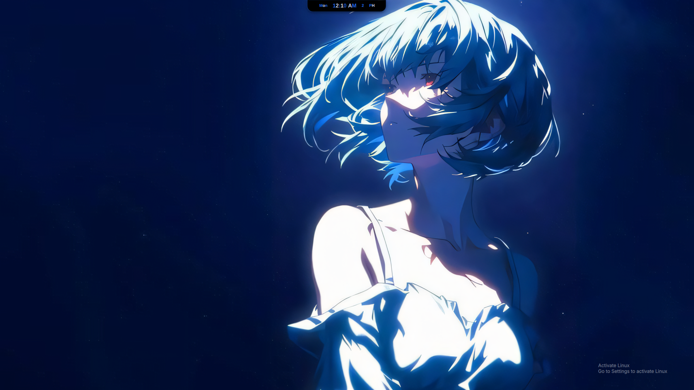
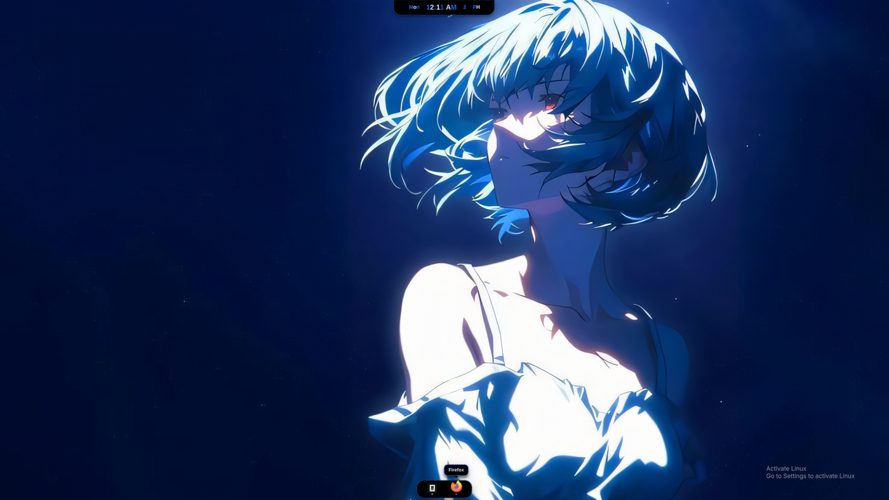
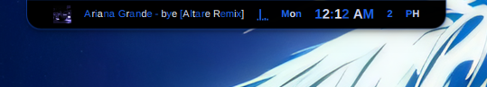
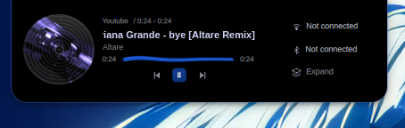

<div align="center">

# Better Bar

**A dynamic-island status bar for Hyprland. One pill per monitor that grows into whatever you need, built on Quickshell.**


[](https://omarchy.org)
[](https://quickshell.outfoxxed.me)
[](LICENSE)

</div>

## What it is

A bar that is mostly not there. A small pill sits at the top centre of every
monitor; hovering or tapping it grows the surface you asked for — media, calendar,
clipboard, mixer, wallpaper, wifi — straight out of the pill, in place. Nothing
moves, nothing pops up as a separate panel, and a surface that is not open costs
nothing on screen.

<p align="center">
  
  
</p>

<p align="center">
  
  
  
</p>

It also carries a floating dock along the bottom edge for pinned and running
apps, with hover magnification and multi-window previews that do not warp your
cursor.

## Features

- **Dynamic island** — one morphing pill per monitor; every surface grows out of the rest pill rather than opening beside it.
- **Dock** — pinned and running apps, hover magnification, multi-window previews, auto-hide, and its own Light / Dark / Dynamic / Manual theme and glass.
- **Surfaces** — launcher, weather, calendar, media, mixer, wallpaper strip and search, clipboard, wifi, bluetooth, battery, power menu, system monitor, notifications, OSD, toasts, settings.
- **Wallpapers** — a shuffled [`awww`](https://github.com/LGFae/awww) bag, live `mpvpaper` video wallpapers, per-wallpaper fit, and a palette pulled from each wallpaper that retints the UI.
- **Extras** — night light, game mode, keep-awake, and an in-app updater.

## Requirements

- Linux on Wayland, with **Hyprland**
- **Quickshell** 0.3.0+ (Hyprland, Wayland and Io modules)
- **Omarchy Quattro** or newer — Better Bar replaces its bar and speaks its plugin IPC
- CLI tools — the installer checks these and tells you what is missing; the full list with package names is in [DEPENDENCIES](DEPENDENCIES.md)

## Install

```bash
omarchy plugin add https://github.com/pxllbt/better-bar.git --enable
```

That clones the plugin, validates the manifest, installs it, and switches the bar
over. There is nothing else to do: the bar is a plugin, so Omarchy's own shell
loads it and there is no second process to autostart.

Restart the shell if the bar does not switch immediately:

```bash
omarchy restart shell
```

Update with `omarchy plugin update pix.bar`, or from the **Update** surface inside
the bar's own settings.

Updating is a `git reset --hard` against the install, so it discards local
commits and uncommitted changes rather than merging with them. The **Update**
surface checks for both first and asks before throwing them away; the CLI
command does not, so keep work you care about on a branch.

<details>
<summary>If the bar stops loading after a system update</summary>

Omarchy runs on a rolling Quickshell, and a package update can leave the
running shell unable to load. The bar is not usually the cause.

```bash
omarchy restart shell
```

If the shell is crash-looping, each restart can leave a ~25 MB core file behind.
Those add up on a tmpfs and will eventually break keybindings and the bar with
them. Check and clear them:

```bash
journalctl --user -t omarchy-shell -e
coredumpctl list
```

Rollback after a bad `quickshell` update:

```bash
sudo pacman -U /var/cache/pacman/pkg/quickshell-*.pkg.tar.zst
```

</details>

<details>
<summary>Standalone install (no Omarchy plugin)</summary>

If you would rather run it as its own Quickshell process — useful outside
Omarchy, or if you want it on a desktop where Omarchy's bar is not in play:

```bash
curl -fsSL https://raw.githubusercontent.com/pxllbt/better-bar/master/remote-install.sh | bash
```

This clones to `~/.local/share/quickshell/better-bar`, checks dependencies, hides
the stock bar (`omarchy toggle bar off`; undo with `omarchy toggle bar on`), and
prints the autostart line and keybinds to add. That mode needs two lines in your
Hyprland config:

```conf
exec-once = ~/.local/share/quickshell/better-bar/launch.sh
exec-once = awww-daemon
```

`launch.sh` sets jemalloc decay options so resident memory tracks the live
working set instead of the session peak (~250 MB RSS). `awww-daemon` starts
alongside it so the wallpaper is painted without waiting on the daemon.

**The two modes are not interchangeable.** Keybinds target a Quickshell instance
by path, and in plugin mode there is no instance at the plugin path — the bar is
inside `omarchy-shell`. Bind to the plugin path and the key does nothing, with
no error. See [Keybinds](#keybinds) for the form that matches your install.

</details>

## Keybinds

Every surface answers over Quickshell IPC on target `better`. An empty monitor
argument means the focused monitor. Which command reaches the bar depends on the
install:

| Install | Command |
| --- | --- |
| Plugin | `omarchy-shell better <surface> ""` |
| Standalone | `qs -p ~/.local/share/quickshell/better-bar ipc call better <surface> ""` |

<details>
<summary>Running the tests</summary>

Six suites run the scripts against sandboxes; the seventh loads the bar in a real
shell. From the repo root:

```bash
bash lib/surfaces-wired.test.sh .        # every navigated surface resolves
bash lib/icon-alignment.test.sh .        # one icon cell size and stroke weight
bash lib/update-guard.test.sh .          # updating cannot silently discard work
bash lib/uninstall-safe.test.sh .        # uninstalling cannot eat your settings
bash lib/alphacoders.test.sh scripts/wallpaper-search.sh
bash lib/wallpaper-owner.test.sh scripts/wallpaper.sh
bash lib/omshell-load.test.sh .          # loads in a real shell, checks IPC
```

Note the two different arguments: three suites take the checkout root, two take
one specific script. Passing a checkout to `alphacoders` or `wallpaper-owner`
reports failures that have nothing to do with the code.

`omshell-load.test.sh` needs a running Wayland session and an `omarchy-shell`
checkout (`SHELL_SRC`, default `/tmp/opencode/fo2/shell`). It redirects
`HOME` **and** all four XDG roots into a sandbox. That is not ceremony: a
version that set only `HOME` deleted a real `~/.local/state/better`, because
the live environment's `XDG_STATE_HOME` and `XDG_CACHE_HOME` still pointed at
the real machine. It does pass `WAYLAND_DISPLAY` and `XDG_RUNTIME_DIR` through,
since the bar cannot be tested without reaching the compositor.

`alphacoders.test.sh` and `wallpaper-owner.test.sh` stub `curl` on `PATH`, so a
real `curl` earlier in `PATH` will make them report failures against nothing.

</details>

Surfaces: `launcher`, `wallpaper`, `clipboard`, `mixer`, `calendar`, `media`,
`power`, `battery`, `sysmon`, `link`. Also `gameMode`, `peek`, `hide`, and
`page <surface>` for anything by name.

```conf
# plugin install
bind = SUPER, SHIFT+W, exec, omarchy-shell better wallpaper ""
bind = SUPER, SHIFT+V, exec, omarchy-shell better clipboard ""
bind = SUPER, slash,   exec, omarchy-shell better launcher ""
```

```conf
# standalone install
bind = SUPER, SHIFT+W, exec, qs -p ~/.local/share/quickshell/better-bar ipc call better wallpaper ""
bind = SUPER, SHIFT+V, exec, qs -p ~/.local/share/quickshell/better-bar ipc call better clipboard ""
bind = SUPER, slash,   exec, qs -p ~/.local/share/quickshell/better-bar ipc call better launcher ""
```

Locking is a script rather than a surface, so it takes a path instead of an IPC
call. Use the plugin path in plugin mode:

```conf
bind = SUPER, L, exec, ~/.config/omarchy/plugins/pix.bar/scripts/lock.sh
```

It runs `hyprlock`, configured by your own `hyprlock.conf`. Better Bar ships no
`hyprlock.conf` and generates none, so the lock looks like it does everywhere
else on your desktop.

## Plugins

No other plugins are needed: the bar ships its own surface for everything the
stock Omarchy plugins do. Your installed plugins still work — any stock
`bar-widget` appears in the pill's strip as-is.

Where a plugin does a job the bar also does, only one can be the default. The
order is **a plugin you picked for the job, then the bar's own surface, then the
stock plugin** — the stock one is suppressed for the jobs the bar covers, so
nothing appears twice. Pick the plugin from the plugins list in settings to make
it the default; remove it, or switch back, and the bar's own surface returns.

## Uninstall

```bash
omarchy plugin remove pix.bar
```

That drops the checkout and points the bar back at the stock one.

To also clear saved settings and caches:

```bash
curl -fsSL https://raw.githubusercontent.com/pxllbt/better-bar/master/uninstall.sh | bash
```

This handles both install modes. Run it with `--dry-run` first to see the exact
list — it is a destructive script and prints what it will remove before it does.
It keeps your saved theme, accent, wallpaper and dock choices by default when it
cannot ask you interactively, and tells you how to drop them if you want them
gone.

Then remove the `exec-once` line and any keybinds you added by hand. Better Bar
never edits your Hyprland config, so it cannot clean those up for you.

## Credits

Built on top of [**Ricelin**](https://github.com/Gakuseei/Ricelin) by
[**Gakuseei**](https://github.com/Gakuseei) — the pill concept, the
morphing-surface architecture, and the original codebase this grew out of — and on
[**Better**](https://github.com/amanhex) by **amanhex**, the codebase as it stood
when this project took it up.

Credit for the base code belongs to those authors. This repository is the
modifications on top: the plugin capability registry, provider handover, stock
plugin suppression, host-shell compatibility, and the release itself.
[NOTICE.md](NOTICE.md) has the full lineage and licenses; both upstream projects
are MIT.

## License

[MIT](LICENSE)